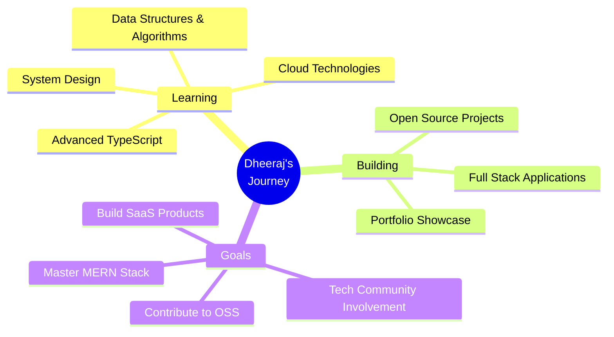

<div align="center">


<br/>

[](https://git.io/typing-svg)

<br/>


</div>

<br/>


<br/>

<div align="center">

## 🌟 About Me

</div>

```typescript
const dheeraj = {
    name: "Dheeraj Gaur",
    title: "Full Stack Developer 💻",
    location: "📍 Aligarh, Uttar Pradesh, India 🇮🇳",
    education: "🎓 B.Tech CSE @ GLA University",
    email: "📧 dheerajgaur.0fficial@gmail.com",
    
    currentMission: "Building scalable web applications & solving real-world problems",
    
    learning: {
        current: ["Data Structures & Algorithms", "System Design", "TypeScript"],
        next: ["Docker", "Kubernetes", "Microservices", "AWS"]
    },
    
    skills: {
        languages: ["JavaScript", "TypeScript", "Java", "HTML/CSS"],
        frontend: ["React", "Tailwind CSS", "Responsive Design"],
        backend: ["Node.js", "Express.js", "REST APIs"],
        database: ["MongoDB", "MySQL"],
        tools: ["Git", "GitHub", "VS Code", "Postman", "Netlify"]
    },
    
    passions: [
        "🎨 Creating Beautiful UI/UX",
        "⚡ Optimizing Performance",
        "🌱 Learning New Technologies",
        "🤝 Collaborating on Open Source"
    ],
    
    lifePhilosophy: "Code with passion, debug with patience ❤️",
    
    funFact: "I can debug code faster than I can debug my life 😄"
};
```

<br/>

<div align="center">

### 🎯 What Drives Me

*"I'm passionate about turning ideas into reality through code. Every project is an opportunity to learn, grow, and create something meaningful. I believe in writing clean, maintainable code and building applications that make a difference."*

</div>

<br/>


<br/>

<div align="center">

## 💻 Tech Stack & Expertise

<br/>


<br/>
<br/>

**Frontend:** React • TypeScript • JavaScript • HTML5 • CSS3 • Tailwind CSS

**Backend:** Node.js • Express.js • Java • REST APIs

**Database:** MongoDB • MySQL

**Tools:** Git • GitHub • VS Code • Postman • NPM • Netlify

</div>

<br/>


<br/>

<div align="center">

## 🚀 Featured Projects

*Building dreams, one commit at a time* ✨

<br/>

</div>

<table align="center" width="100%">
<tr>
<td width="50%" valign="top">

<div align="center">

### 🛒 [BhuwiKart - E-Commerce Platform](https://github.com/dheerajgaurgithub/BhuviKart-E-Commerce-website-)

<br/>


<br/>
<br/>

*A modern, fully responsive e-commerce platform with intuitive UI/UX*

**✨ Features:**
- 🎨 Beautiful & Responsive Design
- 🛍️ Product Catalog & Filtering
- 🛒 Smart Cart Management
- 💳 Seamless Checkout Flow

<br/>

[](https://github.com/dheerajgaurgithub/BhuviKart-E-Commerce-website-)

</div>

</td>

<td width="50%" valign="top">

<div align="center">

### 💝 [ProposeYourCrush](https://github.com/dheerajgaurgithub/ProposeYourCrush)

<br/>


<br/>
<br/>

*Express your feelings in a creative and fun way!*

**✨ Features:**
- 💕 Interactive Proposal Interface
- 🎨 Cute Animations
- 📱 Mobile Friendly
- 🎭 Perfect for Special Occasions

<br/>

[](https://github.com/dheerajgaurgithub/ProposeYourCrush)

</div>

</td>
</tr>

<tr>
<td width="50%" valign="top">

<div align="center">

### 💰 [EarnByCode](https://github.com/dheerajgaurgithub/EarnByCode)

<br/>


<br/>
<br/>

*Gamified coding platform to earn while learning!*

**✨ Features:**
- 🧩 Coding Challenges
- 💎 Reward System
- 📊 Progress Tracking
- 🏆 Leaderboards

<br/>

[](https://github.com/dheerajgaurgithub/EarnByCode)

</div>

</td>

<td width="50%" valign="top">

<div align="center">

### 🌐 [Personal Portfolio](https://dheerajgaurofficial.netlify.app/)

<br/>


<br/>
<br/>

*Clean & professional portfolio showcasing my journey*

**✨ Features:**
- 🎨 Modern Design
- 🌓 Dark/Light Mode
- 📱 Fully Responsive
- ⚡ Fast Loading

<br/>

[](https://github.com/dheerajgaurgithub/Portfolio_deheerajgaur)
[](https://dheerajgaurofficial.netlify.app/)

</div>

</td>
</tr>
</table>

<br/>


<br/>

<div align="center">

## 📈 Contribution Activity

<br/>


</div>

<br/>


<br/>

<div align="center">

## 🐍 Contribution Snake

<br/>

<picture>
  <source media="(prefers-color-scheme: dark)" srcset="https://raw.githubusercontent.com/platane/snk/output/github-contribution-grid-snake-dark.svg">
  <source media="(prefers-color-scheme: light)" srcset="https://raw.githubusercontent.com/platane/snk/output/github-contribution-grid-snake.svg">
  
</picture>

</div>

<br/>


<br/>

<div align="center">

## 🎯 Current Focus

<br/>



</div>

<br/>


<br/>

<div align="center">

## 🤝 Let's Connect & Collaborate!

<br/>

*I'm always excited to connect with fellow developers and work on interesting projects!*

<br/>

[](mailto:dheerajgaur.0fficial@gmail.com)
[](https://www.linkedin.com/in/dheeraj-gaur-9b5410324)
[](https://github.com/dheerajgaurgithub)
[](https://dheerajgaurofficial.netlify.app/)

<br/>
<br/>

[](https://git.io/typing-svg)

<br/>

### 💙 Thanks for stopping by! Feel free to star ⭐ my repositories if you find them interesting!

<br/>

 <em><b>I love connecting with different people</b> so if you want to say <b>hi, I'll be happy to meet you more!</b> 😊</em>

</div>

<br/>


</div>
